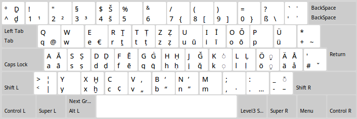

# de_dmg

These keyboard layouts were created sometime between 2010 and 2011. The Windows version is unchanged since then but reportedly still works fine even for Windows 10. The Linux version used to consist of a Debian package that at some point stopped being installable and has now been replaced with a simple Rakefile. See below for instructions. [PR](https://github.com/sixtyfive/de_dmg/compare)s welcome!

## What it looks like



## How to get it

### Windows

See the [ancient release](https://github.com/sixtyfive/de_dmg/releases/tag/ancient) page for installer files or just download the [zip file](https://github.com/sixtyfive/de_dmg/releases/download/ancient/de_dmg-WindowsXP7810-3264.zip) directly, unzip, run `setup.exe`.

After installation, the DMG layout will be immediately available.

## Linux 

Unfortunately, due to the way [Xorg](https://www.x.org/wiki/)-based Linux distributions store keyboard layouts, it's not at all trivial (and probably not advisable in most cases) to create packages that could be installed with one single command, or by simply double-clicking them in a file manager. So the following steps will all have to be executed in a terminal window. If you don't have experience with such a thing or don't feel comfortable doing it, get a friend to do it. If she's got just a little bit of experience with Linux or another Unix-based operating system, chances are this will be easy for her. If there are any problems, please do open an [Issue](https://github.com/sixtyfive/de_dmg/issues/new).

### 1. Prerequisites

For distributions other than the ones listed below, let me know in an [Issue](https://github.com/sixtyfive/de_dmg/issues/new) or, even better, a [PR](https://github.com/sixtyfive/de_dmg/compare)! (For a while now, GitHub has allowed direct editing of files and guides you toward the PR step by step when you commit.)

#### Debian-based (meaning also Ubuntu and Linux Mint)

```
sudo apt install git rake xsltproc bash sed grep coreutils
```

#### Solus 4.0 (possible older, too, but go and upgrade already!)

```
sudo eopkg it git ruby libxslt bash sed grep coreutils
```

### 2. Download

```
git clone https://github.com/sixtyfive/de_dmg.git
```

### 3. Install

```
cd de_dmg/linux
sudo rake install
```

<table><tr><td>After Installation, the DMG layout will <em>not yet</em> be available. Logging the user out and back in again <em>should</em> suffice to make it appear, but depending on whether that causes X to restart or not, a reboot <em>might</em> be required.</td></tr></table>

<table><tr><td><strong>Heads up:</strong> each <em>and every time your system updates the <a href="https://packages.debian.org/search?keywords=xkb-data">xkb-data</a> package, the files modified by the last of the above commands will have the DMG layout removed from them, and the layout will have to be installed again.</em> (The only way to prevent that would be to get <a href="https://github.com/sixtyfive/de_dmg/blob/master/linux/symbols/de">the dmg partial</a> included "upstream", that is, by the <a href="https://www.freedesktop.org/wiki/Software/XKeyboardConfig/Development/">XKB-Config</a> project. If anybody feels inclined to working with them on their mailing list, you'd be doing a solid to every user!)</td></tr></table>

## Contributing

For Windows, you'll need [Microsoft Keyboard Layout Creator 1.4](https://www.microsoft.com/en-us/download/details.aspx?id=22339) which can be used to edit and save [de_dmg.klc](de_dmg.klc) and also to create installer binaries from the the files inside of `windows/`.

For Linux, the [Keyboard Layout Editor](https://code.google.com/archive/p/keyboardlayouteditor/) can be used. It doesn't offer the same convenience as Microsoft's offering for Windows, so the result will have to be saved into the [de](linux/symbols/de) file and everything extraneous be removed manually; also mind the files in `linux/rules/`.

### What about macOS?

Back in 2011, StackExchange wasn't as much of a thing yet as it is today, plus, I've never owned and never will own a Mac. [Nowadays things are simpler](https://superuser.com/questions/665494/how-to-make-a-custom-keyboard-layout-in-os-x). If anyone who reads this and owns a Mac would like to contribute a layout, I'd most happily accept a [PR]((https://github.com/sixtyfive/de_dmg/compare)) for that. According to that last link, you can use [a software called Ukulele](http://scripts.sil.org/cms/scripts/page.php?site_id=nrsi&id=ukelele), by the venerable _SIL International_, to make one.
