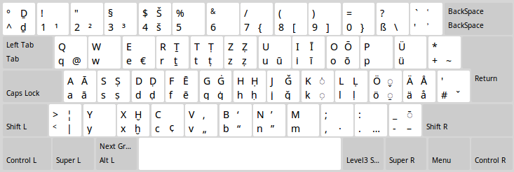

# Current State

These keyboard layouts were created sometime between 2010 and 2011. The Windows version reportedly still works fine even for Windows 10, but the Linux version basically consists of a centuries-old `.deb` file which is not installable anymore on modern Debian-based distributions. Until there's an update here, use it, if you know how to—PRs very welcome!

# Download and install

Please see [the current release page](https://github.com/sixtyfive/de_dmg/releases/tag/ancient).

# What it looks like

# Contributing

For Windows, you'll need [Microsoft Keyboard Layout Creator 1.4](https://www.microsoft.com/en-us/download/details.aspx?id=22339) which can be used to edit and save [de_dmg.klc](de_dmg.klc). For Linux, I've forgotten how it worked and am currently trying to find out again.

## What about macOS?

Back in 2011, StackExchange wasn't as much of a thing yet as it is today, plus, I've never owned and never will own a Mac. [Nowadays things are simpler](https://superuser.com/questions/665494/how-to-make-a-custom-keyboard-layout-in-os-x). If anyone who reads this and owns a Mac would like to contribute a layout, I'd most happily accept a PR for that. According to that last link, you can use [a software called Ukulele](http://scripts.sil.org/cms/scripts/page.php?site_id=nrsi&id=ukelele), by the venerable _SIL International_, to make one.
